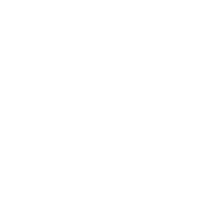
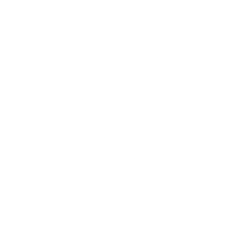
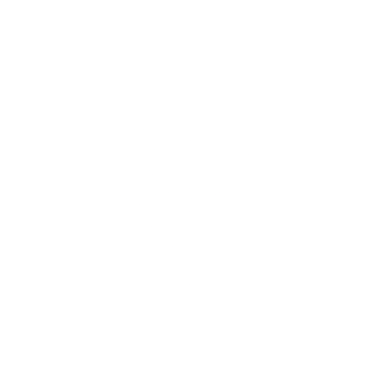

<h1>
  Olá tudo bem?
</h1>

Oi, eu sou o Anthony, tenho 19 anos e sou um jovem apaixonado por tecnologia e programação. Desde 2020, venho mergulhando no mundo do desenvolvimento, criando bugs e aprendendo com eles. :)

---

<h2 align="left">🧪 Sobre Mim</h2>

<table>
<tr><td></td><td>Criando bugs desde 2022</td></tr>
<tr><td></td><td>Atualmente estudando Fullstack e Cybersegurança</td></tr>
<tr><td></td><td>Objetivo: Me tornar desenvolvedor profissional e especialista em segurança</td></tr>
<tr><td></td><td>Curiosidade: Passo mais tempo no terminal do que nas redes sociais</td></tr>
</table>
 

---

<h2 align="left">⚙️ Skills</h2>

  
  
  
  
  
  
  
  
  
  

---

<picture>
  <source media="(prefers-color-scheme: dark)" srcset="https://raw.githubusercontent.com/noahwaldd/noahwaldd/output/pacman-contribution-graph-dark.svg">
  <source media="(prefers-color-scheme: light)" srcset="https://raw.githubusercontent.com/noahwaldd/noahwaldd/output/pacman-contribution-graph.svg">
  
</picture>